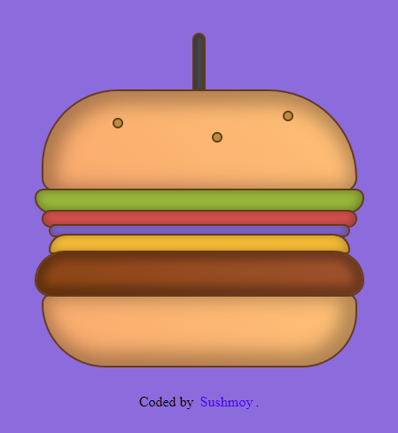

# CSS Burger Delight

This project was created as part of the CSS Art challenge 🎨. The challenge was to showcase creativity in CSS by turning a favorite snack into CSS art.

## Table of Contents

- [Overview](#overview)
- [Features](#features)
- [Screenshot](#screenshot)
- [Links](#links)
- [Technologies Used](#technologies-used)
- [Lessons Learned](#lessons-learned)

## Overview

The CSS Burger Delight project is a CSS art representation of a delicious burger. It was created without using any JavaScript, solely relying on CSS for the design.

## Features

- Represents a mouth-watering burger using CSS styling.
- Utilizes CSS techniques to create shadow effects inside the burger and texture for a realistic appearance.

## Screenshot

## Links

[Include any relevant links here, such as a link to the live demo or the challenge page]

## Technologies Used

The project makes use of the following technologies:

- HTML
- CSS

## Lessons Learned

During the development of CSS Burger Delight, the following key lessons were learned:

1. How to create shadow effects inside an element using `box-shadow`.
2. Creating texture for objects using CSS gradients.

